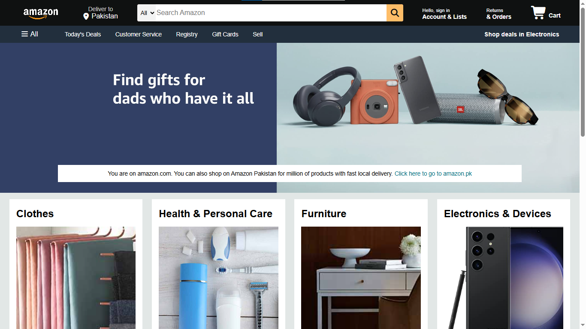
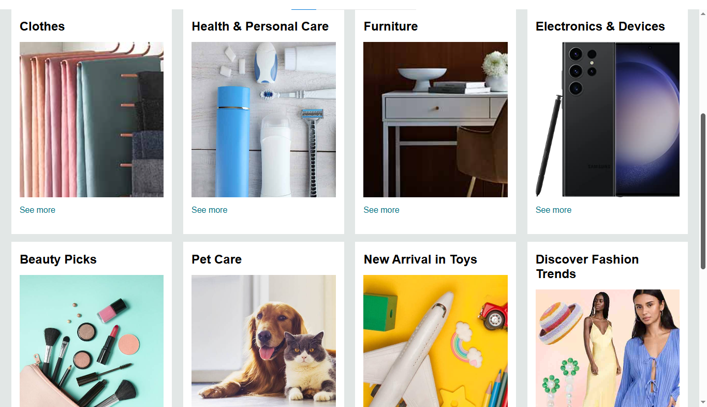
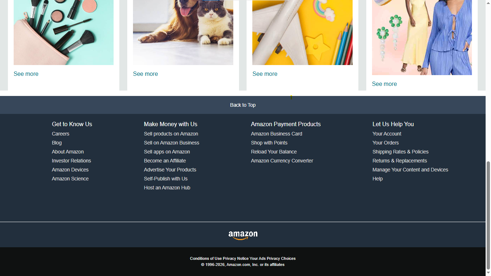

# Amazon Homepage Clone

A responsive clone of the Amazon.com homepage, built from scratch using **HTML5** and **CSS3**. This project recreates the core layout of Amazon's landing page — navbar, category panel, hero banner, and shopping grid — as a front-end practice project.

## Preview

| Navbar |                  | Category Grid |            | Footer |
|:---:|:---:|:---:|
|  |  |  |

## Features

- **Navbar** with logo, delivery address, search bar, sign-in, orders, and cart sections
- **Category panel** with quick links (Today's Deals, Customer Service, Registry, etc.)
- **Hero banner** with promotional message
- **Shop-by-category grid** — 8 category boxes (Clothes, Health & Personal Care, Furniture, Electronics, Beauty, Pet Care, Toys, Fashion Trends)
- **Footer** with site links, payment info, and copyright
- Hover effects on navbar items (border highlight, matching Amazon's real UI behavior)
- Fully responsive layout using Flexbox

## Tech Stack

- HTML5
- CSS3 (Flexbox)
- [Font Awesome](https://fontawesome.com/) (via CDN) for icons

## Project Structure

```
Project/
├── index.html
├── style.css
├── amazon_logo.png
├── hero_image.jpg
└── box1_image.jpg ... box8_image.jpg
```

## How to Run

No build steps or dependencies required.

1. Clone or download this repository
2. Open `index.html` in any web browser

```bash
git clone https://github.com/<your-username>/amazon-clone.git
cd amazon-clone
```

Then just double-click `index.html`, or open it directly in your browser.

## Notes

This is a static front-end clone built for learning/practice purposes and is **not affiliated with or endorsed by Amazon**. It does not include backend functionality (search, cart, checkout, etc.) — it's a UI/layout exercise.

## Author

Built by Rizwan as a front-end development practice project.
